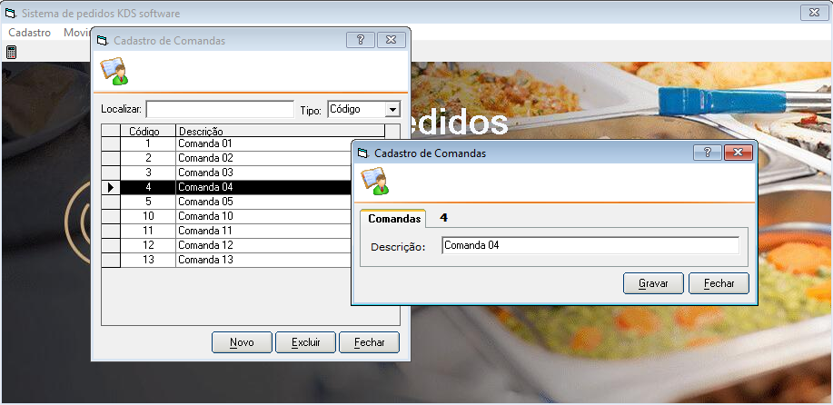

# SISTEMA TESTE EM VISUAL BASIC 6 - DESKTOP
 
<h1 align="center">
    
</h1>
 
## SOFTWARE DE KDS PARA A COZINHA DO RESTAURANTE
O restaurante trabalha com atendimento de mesas. O garçom anota todos os pedidos das pessoas que estão na mesa “X” e “libera/envia” o pedido para as cozinhas (preparação dos pratos). Atualmente o restaurante possui diversas cozinhas para preparação dos pratos. Após a preparação dos pratos, o garçom serve as pessoas da mesa. 

## SOFTWARE DE KDS PARA A COZINHA DO RESTAURANTE
Como o restaurante possui diversas cozinhas e o pedido da mesa pode conter pratos com tempo de preparo totalmente diferentes, geralmente temos problemas com os preparos dos pratos. Por exemplo: em uma mesa com 6 pessoas, 2 pessoas pedem Pizza, 2 pessoas pedem Sushi Frio e as outras pedem pratos quentes (carnes, etc) - o pedido é enviado ao mesmo tempo para as cozinhas (até aqui tudo bem), porém as cozinhas começam o preparo e terminam em tempos totalmente diferentes, com isso: 

a) Se o garçom entregar os pratos conforme as cozinhas terminam o preparo (individualmente), cada pessoa recebe o prato em um horário, sendo assim a pessoa 1 come, e as outras ficam olhando, a primeira e segunda pessoa termina de comer e somente depois chega o prato das outras pessoas;

b) Se o garçom esperar todos os pratos ficarem prontos para entregar tudo de uma vez, ocorre outro problema, dependendo do prato, ele esfria e a pessoa come o prato já frio. 

## IDEAL
O ideal seria as cozinhas receberem o horário que o devem iniciar o preparo do prato, uma vez que cada prato tem um tempo médio de preparo. Com isso os pratos seriam entregues ao mesmo tempo para todas as pessoas, todos comem ao mesmo tempo e o restaurante ganha 5 estrelas e ótimos comentários. 
